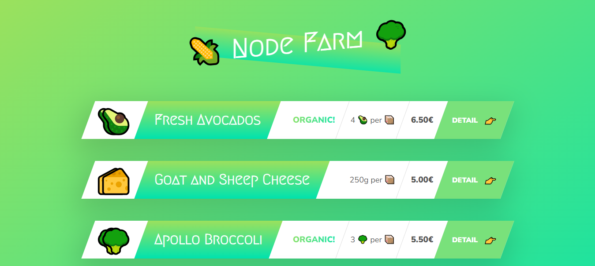
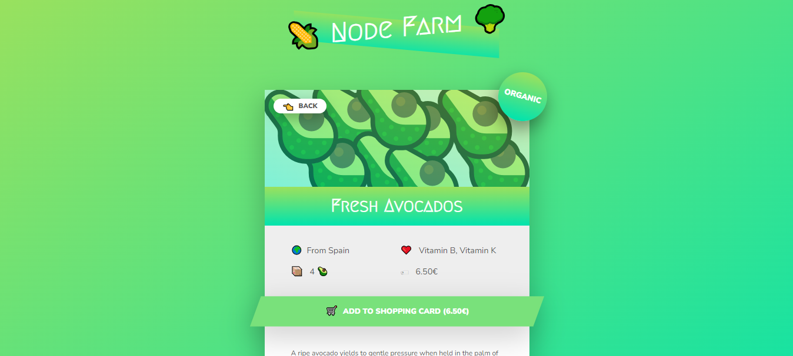

# Node Farm

Node Farm displays products and their details. This app is server side rendered and was my first project while learning node js from udemy (jonas).

## Objectives

- Learning Node and creating server.
- Learning server side rendering and rendering engines.

## Getting Started

**Open in VSCode:**
Open the project in VSCode.

**Run Server:**
run the following commands in the root directory.

- npm install
- npm start
- visit the url http://localhost:8000/ in the browser

**User Interactions:**

- See all the products on homepage.
- See a single product with the details.
